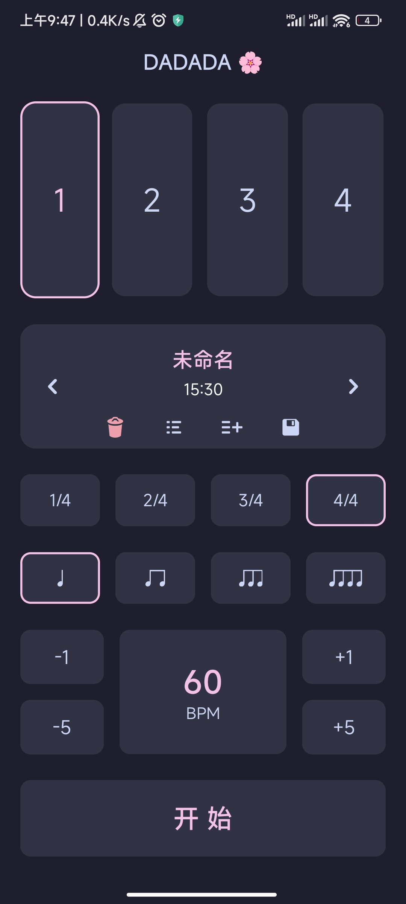

# DADADA

一个简约的吉他节拍器，基于 `React Native` 开发，配色使用 `catppuccin`

音效来自 [jsfxr](https://sfxr.me/)

[下载地址](https://mayapony.lanzoub.com/b01f2mo9e) 密码：6666

[Expo下载地址](https://expo.dev/artifacts/eas/sPY2M1PbuFRvovgW7L6ZPf.apk)



<br />

---

<br />

TODO List:

- [x] 速度调节
- [x] 节拍类型选择 (4/4 2/4 1/4 ...)
- [x] Pattern 选择
- [ ] web 预览
- [ ] 保存一个设置
- [ ] 录音
- [ ] 记录练习时长


<br />

音效，使用 `jsfxr` Deserialize：

```json
{
  "oldParams": true,
  "wave_type": 1,
  "p_env_attack": 0,
  "p_env_sustain": 0.067,
  "p_env_punch": 0,
  "p_env_decay": 0.033,
  "p_base_freq": 0.505,
  "p_freq_limit": 0,
  "p_freq_ramp": 0,
  "p_freq_dramp": 0,
  "p_vib_strength": 0,
  "p_vib_speed": 0,
  "p_arp_mod": 0,
  "p_arp_speed": 0,
  "p_duty": 1,
  "p_duty_ramp": 0,
  "p_repeat_speed": 0,
  "p_pha_offset": 0,
  "p_pha_ramp": 0,
  "p_lpf_freq": 1,
  "p_lpf_ramp": 0,
  "p_lpf_resonance": 0,
  "p_hpf_freq": 0.1,
  "p_hpf_ramp": 0,
  "sound_vol": 0.501,
  "sample_rate": 11025,
  "sample_size": 8
}
```
